# Scattering Core

[](https://central.sonatype.com/artifact/eu.scattering/eu.scattering.core.lib)
[](https://pypi.org/project/scatter-cli/)
[](https://www.npmjs.com/package/@light-scattering/scatter-cli)

Scattering Core is a highly optimized Java library designed for the generation and morphological analysis of synthetic fractal aggregates.

> **Note:**
> This documentation is actively being expanded. It currently focuses on the specific methods required to reproduce the findings of the recently submitted manuscript.

## Table of contents

- [Ecosystem and installation](#ecosystem-and-installation)
  - [Core library](#core-library)
  - [CLI and wrappers](#cli-and-wrappers)
- [Background and scope](#background-and-scope)
- [Development and AI transparency](#development-and-ai-transparency)
- [Roadmap](#roadmap)
  - [Web interface and containerization](#web-interface-and-containerization)
  - [Modularization and licensing](#modularization-and-licensing)
- [Project structure](#project-structure)
- [Engine initialization](#engine-initialization)
- [Computational parameters](#computational-parameters)
- [Generation algorithms](#generation-algorithms)
  - [Direct construction](#direct-construction)
  - [Model-based generations](#model-based-generation)
    - [PC models](#pc-models)
    - [CC models](#cc-models)
- [Loading, saving, and exporting](#loading-saving-and-exporting)
- [Morphological analysis](#morphological-analysis)
    - [Core properties](#core-properties)
    - [Connectivity and overlap](#connectivity-and-overlap)
    - [Linear measurements](#linear-measurements)
    - [Centers of mass and geometry](#centers-of-mass-and-geometry)
    - [Surface and volume](#surface-and-volume)
    - [Gyration metrics](#gyration-metrics)
    - [Topological metrics](#topological-metrics)
    - [Fractal dimension](#fractal-dimension)
        - [Structural methods](#structural-methods)
        - [Kinetic methods](#kinetic-methods)
            - [PC aggregation](#particle-cluster-pc-aggregation)
            - [CC aggregation](#cluster-cluster-cc-aggregation)
- [How to cite](#how-to-cite)
- [License](#license)

## Ecosystem and installation

Depending on your workflow, you can interact with Scattering Core at three different levels: integrating the advanced core library, running the standalone Java CLI, or using a language-specific wrapper.

### Core library

The core library provides the most advanced and complete functionality. It is published to the Maven Central Repository and consists of two dependencies. You can include them in your Java projects using Gradle or Maven by replacing `VERSION` with the latest release number:

**Gradle**

```groovy
implementation 'eu.scattering:eu.scattering.core.lib:VERSION'
implementation 'eu.scattering:eu.scattering.core.design:VERSION'
```

**Maven**

```xml
<dependency>
    <groupId>eu.scattering</groupId>
    <artifactId>eu.scattering.core.lib</artifactId>
    <version>VERSION</version>
</dependency>
<dependency>
    <groupId>eu.scattering</groupId>
    <artifactId>eu.scattering.core.design</artifactId>
    <version>VERSION</version>
</dependency>
```

### CLI and wrappers

While the core library offers complete programmatic control, a standalone Java CLI provides simplified, ready-to-use functionality. To run this CLI from your terminal without manually handling Java archives, you can use the official Node.js or Python wrappers. These automatically bundle and execute the underlying Java tool.

| Ecosystem   | Registry | Package                                                                                        |
|-------------|----------|------------------------------------------------------------------------------------------------|
| **Node.js** | NPM      | [`@light-scattering/scatter-cli`](https://www.npmjs.com/package/@light-scattering/scatter-cli) |
| **Python**  | PyPI     | [`scatter-cli`](https://pypi.org/project/scatter-cli/)                                         |

*Note: There are no plans to introduce wrappers for additional languages at this time.*

For detailed setup and usage instructions, refer to the [CLI documentation](eu.scattering.cli/README.md).

## Background and scope

The core aggregation elements were built upon the foundation of my previous project, FLAGE (Fractal-Like Aggregate Generation Environment). However, is not a simple port - the entire codebase was rewritten almost from scratch to be modernized, optimized, and extensible.

Because the project is massive, and I am currently the sole developer, this manual focuses strictly on high-level features, such as aggregation models and morphological analysis. Low-level elements (like `FPoint` or `FVector`) are excluded from this guide. If you wish to utilize them in your own projects, please refer to the `design` module, where all interfaces are clearly defined.

## Development and AI transparency

This project began several years ago, well before the LLM era. As a result, the architectural foundation was built the old-school way: through academic literature, official documentation, and naturally Stack Overflow.

During the later stages of development, maintaining the scientific correctness and cleanliness of the code remained the highest priority. AI was used primarily as a research assistant - sourcing information, suggesting component names, and generating initial drafts for a few isolated mathematical functions (such as calculating the gyration tensor or performing PCA).

To maintain transparency, methods that originated from an LLM prompt are explicitly flagged using a custom `@LLM` annotation. Furthermore, the generated code was only used as a baseline. Every single line within those marked methods was subsequently refactored, manually analyzed, and tested to ensure strict scientific accuracy.

On the other hand, since this manual is neither executable code nor a formal manuscript, I allowed an LLM to polish, structure, and rewrite my original drafts for better readability. The same approach was applied to the wrappers and build tools (which are separate from the core library). While the AI was not used to write the code directly, the development of these peripheral elements followed modern workflows, utilizing the LLM as an assistant and interactive guide.

## Roadmap

While Scattering Core is currently highly functional for the generation and morphological analysis of synthetic aggregates, it is an actively evolving project. My future development plans focus on two major areas: accessibility and architectural modularization.

### Web interface and containerization

To make the tool more accessible to users who prefer visual dashboards over command-line tools, I plan to develop a fully integrated graphical user interface (GUI). This initiative will include:
* **Frontend:** Building a modern React web application to configure generation parameters, execute analysis tasks, and visualize the resulting 3D models.
* **Backend:** Developing a lightweight REST backend endpoint that exposes the core engine's capabilities.
* **Docker:** Packaging the entire stack into a single Docker container. This will allow anyone to spin up the complete GUI environment locally with a single command, without worrying about Java versions or node modules.

### Modularization and licensing

Currently, the entire repository is published under the strong copyleft AGPLv3 license. However, to better support the wider open-source community, I plan to eventually extract the low-level utilities into a separate, standalone library released under the permissive **MIT License**. This will allow researchers and developers to reuse these foundational components in their own projects without being bound by the AGPLv3. Until that split occurs, any external pull requests that modify these core utilities will require the contributor's consent to dual-license their additions, ensuring a smooth transition when the time comes.

## Project structure

The repository is divided into the following modules:

* **`design`** — Contains all public interfaces and serves primarily as API reference documentation.
* **`lib`** — Contains the core implementation of the design, including the main entry point.
* **`cli`** — Provides a command-line interface and is used to build a standalone, executable JAR file.
* **`front`** — In progress...
* **`back`** — In progress...
* **`docker`** — In progress...

> **Note:** This manual focuses exclusively on the **`design`** and **`lib`** modules. The **`cli`** module is documented separately in its [own project README file](eu.scattering.cli/README.md).
>

## Engine initialization

All generation and analysis operations begin with the `ScatterFactory`, which serves as the core entry point for the library. The factory can be initialized in one of two main operating modes depending on your needs for reproducibility and performance.

**Reproducible mode**

This mode requires a seed value. When it is provided, all subsequent operations are executed on a single thread and are fully deterministic. If you generate an aggregate or run an analysis using the same seed, the results will be identical every time.

```java
// Initialize the factory with a specific seed for full reproducibility.
ScatterFactory factory = ScatterCore.createFactory(123L);

// Alternatively, pass -1L to randomly generate a seed. 
// The generated seed will be printed to the console at startup so you can reuse it later.
ScatterFactory factory = ScatterCore.createFactory(-1L);
```

**Performance mode**

If reproducibility is not required, you can initialize the factory without a seed. This mode utilizes a different, non-deterministic random generation strategy. As a result, it is extremely unlikely that the exact same aggregate structure will be generated twice.

*(While current development strictly prioritizes mathematical correctness for research publication, the unseeded mode lays the architectural groundwork for multithreaded performance optimizations planned for a near-future release)*

```java
// Initialize the factory for maximum multi-threaded performance.
ScatterFactory factory = ScatterCore.createFactory();
```

## Computational parameters

Calculations rely on two core tolerances to maintain numerical stability. Both can be configured globally for an aggregate or fine-tuned per particle.

**Epsilon (continuous tolerance)**

The positional threshold used for positioning 3D geometries.
* **Default:** `1E-4`
* **When to adjust:** Modify this when importing files or working with external algorithms to match their specific definitions of point contact and overlap.

```java
fAggregate.setParticleEpsilon(1E-4);   // Apply tolerance to the entire aggregate.
fParticle.setEpsilon(1E-4);            // Override tolerance for a single particle.
```

**Delta (discrete tolerance)**

The threshold used for volumetric calculations. It defines the element resolution when operations require discretizing continuous space.
* **Default:** `1E-2`
* **When to adjust:** Unlike epsilon, there is no universal recommended value. Tune this based on the scale and complexity of the analyzed geometry.

```java
fAggregate.setParticleDelta(1E-2);      // Apply tolerance to the entire aggregate.
fParticle.setDelta(1E-2);               // Override tolerance for a single particle. 
```

**Memory buffering for discrete operations**

Heavy discrete operations (like mesh decomposition) require a reusable data buffer to maintain high performance and prevent memory churn. You should allocate and inject an `FBuffer` into the aggregate before running these calculations:

```java
// Initialize and inject a pre-allocated reusable mesh buffer.
FBuffer<FBufferData> fBuffer = factory.getFBuffer(1_000_000);
fAggregate.setRefFBuffer(fBuffer);
```

## Generation algorithms

Aggregates can be constructed in two primary ways: **direct construction** (where particles are explicitly positioned by the developer) and **model-based generation** (where algorithms position particles dynamically).

### Direct construction

In this approach, you explicitly define the coordinates and geometry of each particle before assembling the aggregate:

```java
// Explicitly define particles with specific center coordinates and radii.
FSphere pA = factory.getFSphere(0, 0, 0, 1);
FSphere pB = factory.getFSphere(2, 0, 0, 1);

// Construct the aggregate from the predefined list.        
FAggregate agg = factory.getRefFAggregate(List.of(pA, pB));
```

While this method is ideal when feeding in coordinates from external algorithms, writing it by hand is tedious and error-prone. To accelerate the process, the library provides built-in utilities for generating common geometric arrangements (note, that the available list of predefined geometries is frequently expanded).

```java
double rp = 1;  // Particle radius

// Create a 1D line composed of 10 spherical particles.
FAggregate d1 = factory.aggregates().geometries().grid1D(10, rp);
// Create a 2D grid composed of 10x12 spherical particles.
FAggregate d2 = factory.aggregates().geometries().grid2D(10, 12, rp);
// Create a 3D lattice composed of 10x12x14 spherical particles.
FAggregate d3 = factory.aggregates().geometries().grid3D(10, 12, 14, rp);

// Create a 2D hexagonal cluster limited by an outer radius of 20 units.
FAggregate hex2 = factory.aggregates().geometries().hex2D(20, rp);
// Create a 3D hexagonal cluster limited by an outer radius of 30 units.
FAggregate hex3 = factory.aggregates().geometries().hex3D(30, rp);
```

For highly complex structural geometries the library offers advanced stochastic tools like Producers and Distributions. While a comprehensive guide to these features will be covered in an upcoming tutorial, below are two examples demonstrating how to construct a TiO2:Ag core-satellite composite and a multi-modal particle assembly:

```java
// Create the central particle (TiO2) and tag it. 
// Tags connect geometries to their physical properties (e.g., refractive index).
FSphere particleTiO2 = factory.getFSphere(36).setMeta("TiO2");

// Configure a producer to generate the surrounding particles (Ag).
FSphereProducer particleAg = factory.getFSphereProducer()
        // GENERATORS: Define the initial placement and sizing.
        // You can chain multiple predefined or custom generators. 
        // Here, a predefined generator places centers on a sphere and assigns radii via a normal distribution.
        .withProdCenterAndDistRadius(
                factory.getFPointProducer().withOnSphere(36),
                factory.generator().getFDist1DNormal(2.5, 0.2))
        // CORRECTIONS: Apply spatial modifications to the generated geometry.
        // You can apply multiple predefined or custom corrections. 
        // Here, a custom lambda snaps each candidate into exact point-contact with the core.
        .addCorrection((candidate, rnd) ->
                factory.generator().attachLinear(candidate, particleTiO2))
        // VALIDATIONS: Enforce strict criteria the particle must pass to be accepted.
        // You can require multiple predefined or custom validators.
        // Here, a predefined validator rejects any candidate that overlaps with previously placed particles.
        .validateNoOverlap()
        // METADATA: Apply the corresponding tag to all generated instances.
        .setMeta("Ag");

// Generate an aggregate containing 250 Ag particles, then append the core TiO2 particle.
FAggregate composite = factory.getRefFAggregate(particleAg.getListFixed(250));
composite.addRefParticle(particleTiO2);

// Export the finalized composite to a PovRay script for 3D visualization.
String visual = factory.save().components().toPovRay(composite, ExPovRay.FREE);
```

```java
// Define the total number of particles to generate.
int size = 2500;

// Define a uniform 3D bounding box for spatial distribution.
FDist3D rangeA = factory.generator().getFDist3DUniform(factory.getFPairPos3D(-200, -100, -100, 200, 100, 100));
// Define a 3D normal distribution (centered at the origin by default) with custom standard deviations.
FDist3D rangeB = factory.generator().getFDist3DNormal().setStd(50, 25, 25);

// Configure a producer to generate particles using a weighted mix of generators.
FSphereProducer particles = factory.getFSphereProducer()
        // GENERATORS: Chain multiple predefined or custom generators with assigned selection weights.
        // 90% probability: Place small particles (radius 1.0) uniformly within the bounding box.
        .withDistCenterAndDistRadius(rangeA, factory.generator().getFDist1DNormal(1.0, 0.1), 90)
        // 10% probability: Place intermediate particles (radius 5.0) clustered via the normal distribution.
        .withDistCenterAndDistRadius(rangeB, factory.generator().getFDist1DNormal(5.0, 1), 10)
        // VALIDATIONS: Enforce strict criteria candidates must pass to be accepted.
        // Here, a predefined validator rejects any candidates that overlap with existing particles.
        .validateNoOverlap()
        // Overlap validation can frequently fail in dense clusters. This allows infinite regeneration attempts (default is 100).
        .setRetriesInfinite();

// Generate an aggregate of 2,500 particles drawn randomly based on the defined generator weights.
FAggregate geometry = factory.getRefFAggregate(particles.getListRandomized(size));

// Export the finalized geometry to a PovRay script for 3D visualization, including the visual boundary.
String visual = factory.save().components().toPovRay(geometry, ExPovRay.BOUNDARY);
```

<div align="center">
  <table>
    <tr>
      <td>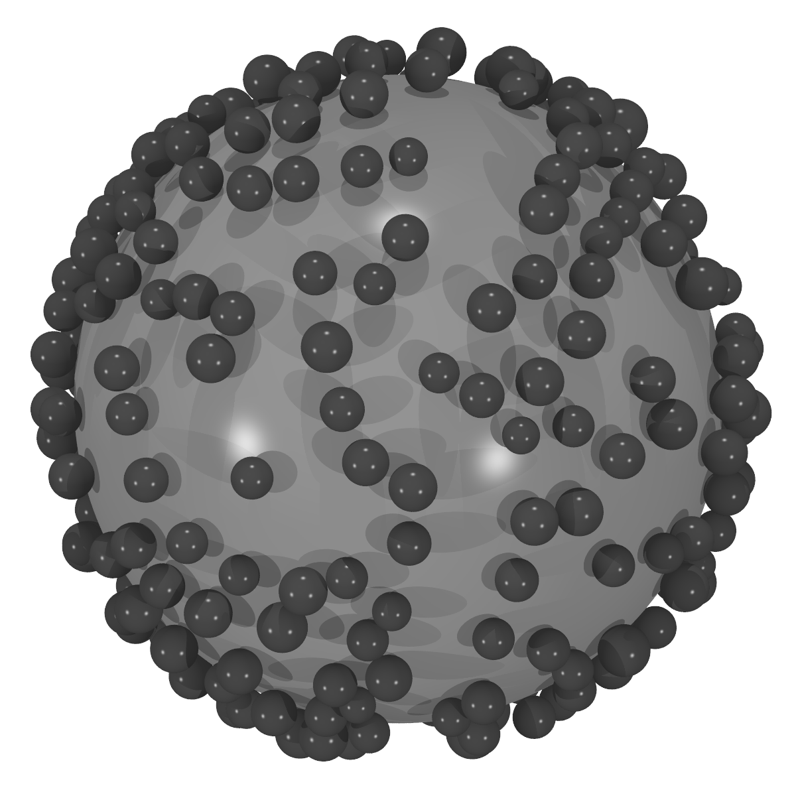</td>
      <td>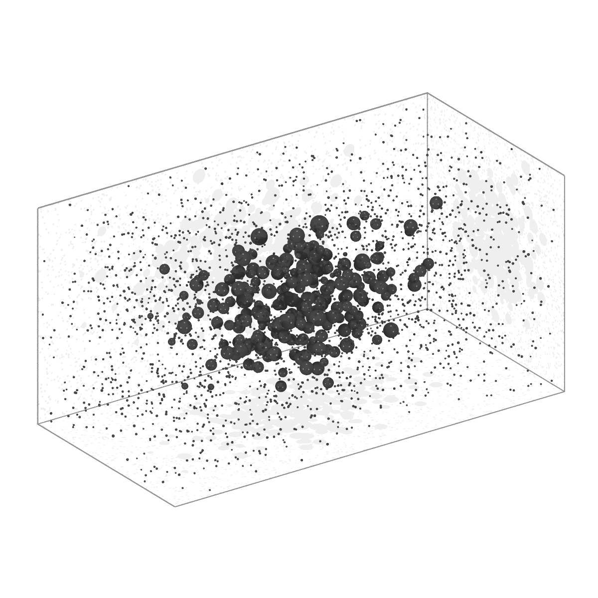</td>
    </tr>
    <tr>
      <td align="center"><em>Fig 1a: TiO2:Ag composite.</em></td>
      <td align="center"><em>Fig 1b: Multimodal particle assembly.</em></td>
    </tr>
  </table>
</div>

### Model-based generation

In this approach, you define the initial pool of particles, but their final spatial positions are determined entirely by an aggregation model.

This decoupled architecture was designed to overcome a major limitation in previous software versions, where particles were generated during the aggregation process. While on-the-fly generation worked fine for monodisperse aggregates, complex polydisperse structures suffered from poor reproducibility, yielding vastly different morphological parameters on every run. By pre-allocating the particle pool first, you can run multiple spatial assemblies using the exact same underlying physical parameters. This guarantees highly precise comparisons across different aggregation models.

To accelerate setup, the library includes built-in utilities for generating common initial distributions. These methods generate a dense pool of particles temporarily centered at the origin of the Cartesian grid, ready to be dispersed by a model. Keep in mind that any aggregate, even one constructed directly, can be fed into an aggregation model.

```java
// Generate an aggregate composed of 1,000 primary particles with a uniform radius of 1 unit.
FAggregate mono = factory.aggregates().templates().monodisperse(1_000, 1.0);
// Generate an aggregate composed of 1,000 primary particles with radii following a normal distribution.
FAggregate polyAgg = factory.aggregates().templates().polydisperse(1_000, 1.0, 0.1);
```

To shape the geometry, you must define an aggregation model and bind it to your preliminary particle pool.

```java
// Create a preliminary pool of 10,000 primary particles with radii following a normal distribution.
FAggregate aggregate = factory.aggregates().templates().polydisperse(10_000, 1, 0.1);

// Define a 3D ballistic CC aggregation model (3D is the default).
FModelCC d3 = factory.models().cc().ballistic(aggregate);

// Define a 2D ballistic CC aggregation model. 
// The first parameter of every model constructor is optional and defines the spatial dimensions.
FModelCC d2 = factory.models().cc().ballistic(Dimension.D2, aggregate);

// Execute the 3D ballistic CC aggregation.
d3.build();

// Export the 3D visualization.
String d3Visual = factory.save().components().toPovRay(aggregate, ExPovRay.FREE);

// Execute the 2D ballistic CC aggregation (reusing the same particle pool).
d2.build();

// Export the 2D visualization.
String d2Visual = factory.save().components().toPovRay(aggregate, ExPovRay.FREE);
```

<div align="center">
  <table>
    <tr>
      <td>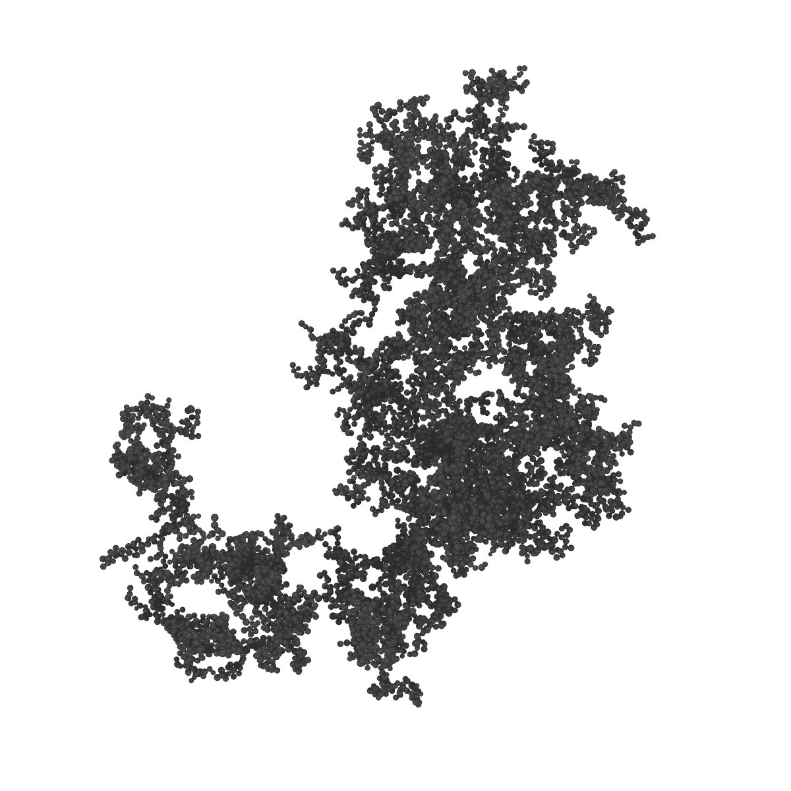</td>
      <td>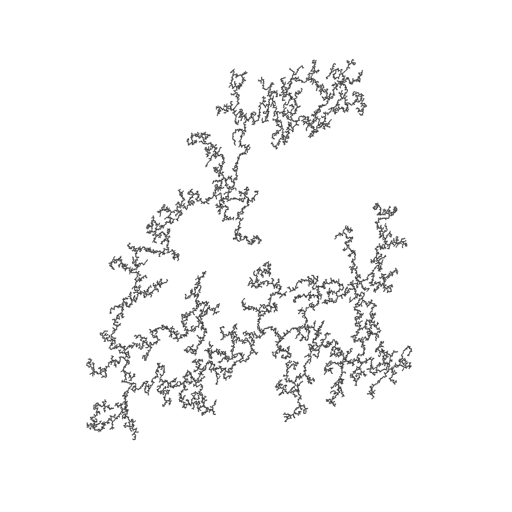</td>
    </tr>
    <tr>
      <td align="center"><em>Fig 2a: Visualization of a ballistic CC 3D aggregate.</em></td>
      <td align="center"><em>Fig 2b: Visualization of a ballistic CC 2D aggregate.</em></td>
    </tr>
  </table>
</div>

Each model might contain individual configuration options, such as particle spawn ring, exclusion range, motion algorithm, etc. However, they will be described in more detain in an upcoming tutorial. This one focuses on basic features only. All models are divided into two main categories, namely Particle-Cluster (PC) and Cluster-Cluster (CC). Note, that all models have 3D and 2D variants.

#### PC models

Particle-Cluster methods build aggregates by attaching a single particle at a time. While they produce geometries that are slightly less physically accurate than Cluster-Cluster (CC) methods, they provide a much wider spectrum of achievable fractal dimensions.

```java
// Create a preliminary pool of 1,000 monodisperse primary particles.
FAggregate aggregate = factory.aggregates().templates().monodisperse(1_000, 1);

// Access the PC model factory context.
FModelPCFactoryContext context = factory.models().pc();

// Initialize standard PC models.
FModelPC rla = context.rla(aggregate);              // Reaction-Limited Aggregation.
FModelPC dla = context.dla(aggregate);              // Diffusion-Limited Aggregation.
FModelPC ballistic = context.ballistic(aggregate);  // Ballistic aggregation.

// Initialize a tunable aggregation model.
// This is the only model that accepts explicit fractal parameters (dimension and prefactor).
FModelPC tunable = context.tunable(aggregate, 1.8, 1.3);
```

<div align="center">
  <table>
    <tr>
      <td>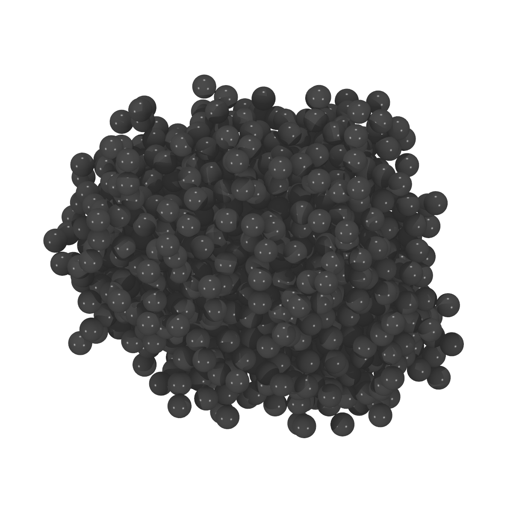</td>
      <td>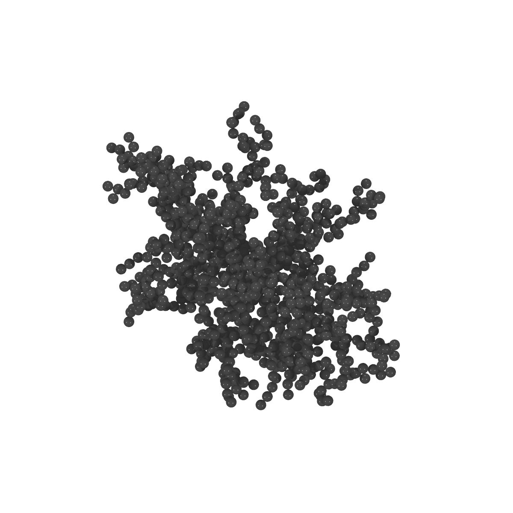</td>
    </tr>
    <tr>
      <td align="center"><em>Fig 3a: RLA aggregate.</em></td>
      <td align="center"><em>Fig 3b: DLA aggregate.</em></td>
    </tr>
    <tr>
      <td>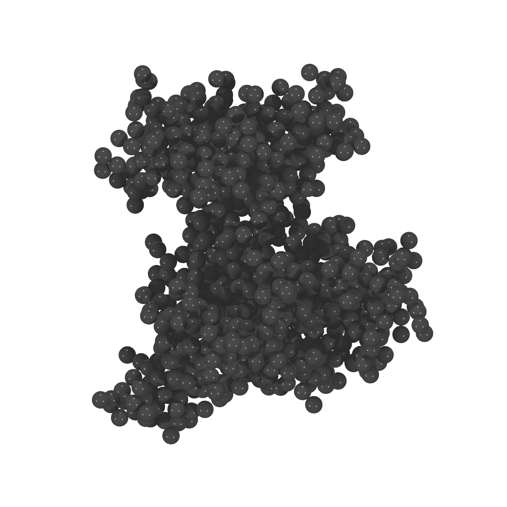</td>
      <td>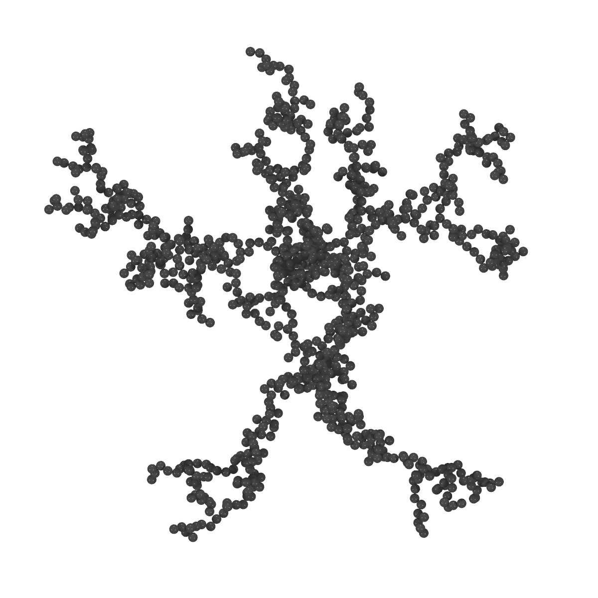</td>
    </tr>
    <tr>
      <td align="center"><em>Fig 3c: PC ballistic aggregate.</em></td>
      <td align="center"><em>Fig 3d: PC tunable aggregate.</em></td>
    </tr>
  </table>
</div>

**PC lifecycle control (validators, acceptors, and monitors)**

You can tightly control the aggregation logic by attaching multiple evaluation hooks to PC models:

Completion validators evaluate the final state of the aggregate.
```java
// If the fully generated geometry fails this condition, the entire aggregation process restarts.
fModel.addCompletionValidator((cluster, iteration) ->
        // Enforce a strict fractal dimension using the Mass-Radius algorithm.
        cluster.getFractalDimension(FractalDimension.MR_RESTRICTED) > 2.5);
```

Step acceptors evaluate each individual particle as it attempts to attach.
```java
// If a candidate particle fails this condition, it is rejected and the attachment step repeats.
fModel.addStepAcceptor((cluster, candidate) ->
        // Constrain all attached particles to a specific spatial range.
        candidate.getCenterX() > -10 && candidate.getCenterX() < 10);
```

Step monitors track dynamic data during the build process without altering the geometry.
```java
List<Double> diameters = new ArrayList<>();

// Its task is to observe and record data across all stages of aggregation.
fModel.addStepMonitor((cluster, particle) -> {
        // Note on lifecycle stages:
        // - First iteration: The cluster is null. The first particle is positioned but not yet clustered.
        // - Final iteration: The particle is null. The cluster is fully assembled with no new candidates.
        if (cluster != null) {
            diameters.add(cluster.getDiameter());
        }
});
```

#### CC models

Cluster-Cluster methods at each step of the aggregation process connect two clusters of exact (or similar) size to form a larger one. The procedure starts with generating small aggregates using the complementary PC method. Resulting geometries are more realistic, however, the aggregation process is more complex and extreme fractal dimensions are difficult to achieve. Also, while the growing PC cluster is stationary, CC clusters can be repositioned multiple times before the final geometry is complete.

```java
// Create a preliminary pool of 1,000 monodisperse primary particles.
FAggregate aggregate = factory.aggregates().templates().monodisperse(1_000, 1);

// Access the CC model factory context.
FModelCCFactoryContext context = factory.models().cc();

// Initialize standard CC models.
FModelCC rlca = context.rla(aggregate);             // Reaction-Limited Cluster Aggregation.
FModelCC dlca = context.dla(aggregate);             // Diffusion-Limited Cluster Aggregation.
FModelCC ballistic = context.ballistic(aggregate);  // Ballistic aggregation.

// Initialize a tunable aggregation model.
// This is the only model that accepts explicit fractal parameters (dimension and prefactor).
FModelCC tunable = context.tunable(aggregate, 1.8, 1.3);
```

<div align="center">
  <table>
    <tr>
      <td>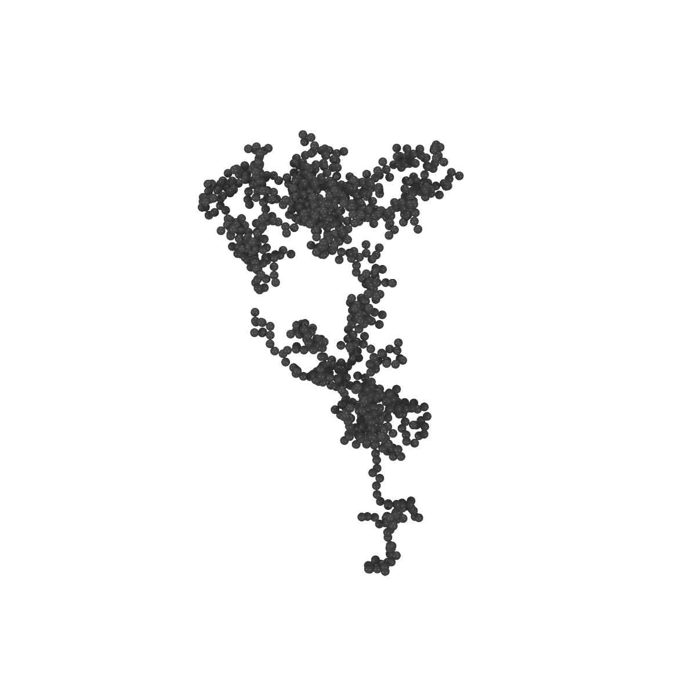</td>
      <td>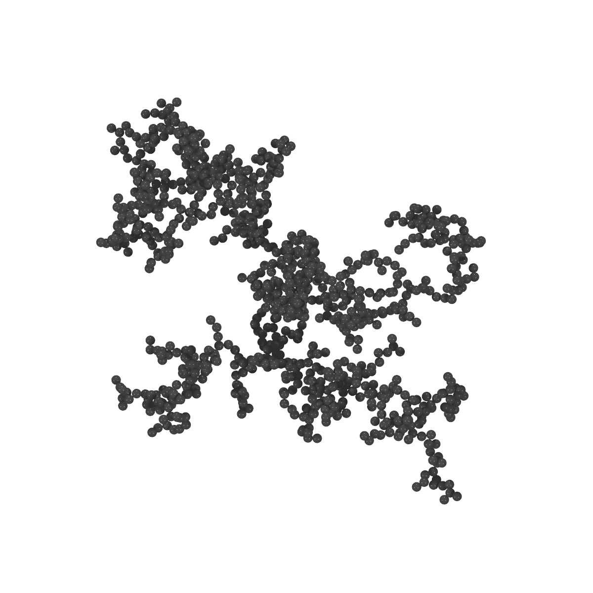</td>
    </tr>
    <tr>
      <td align="center"><em>Fig 4a: RLCA aggregate.</em></td>
      <td align="center"><em>Fig 4b: DLCA aggregate.</em></td>
    </tr>
    <tr>
      <td>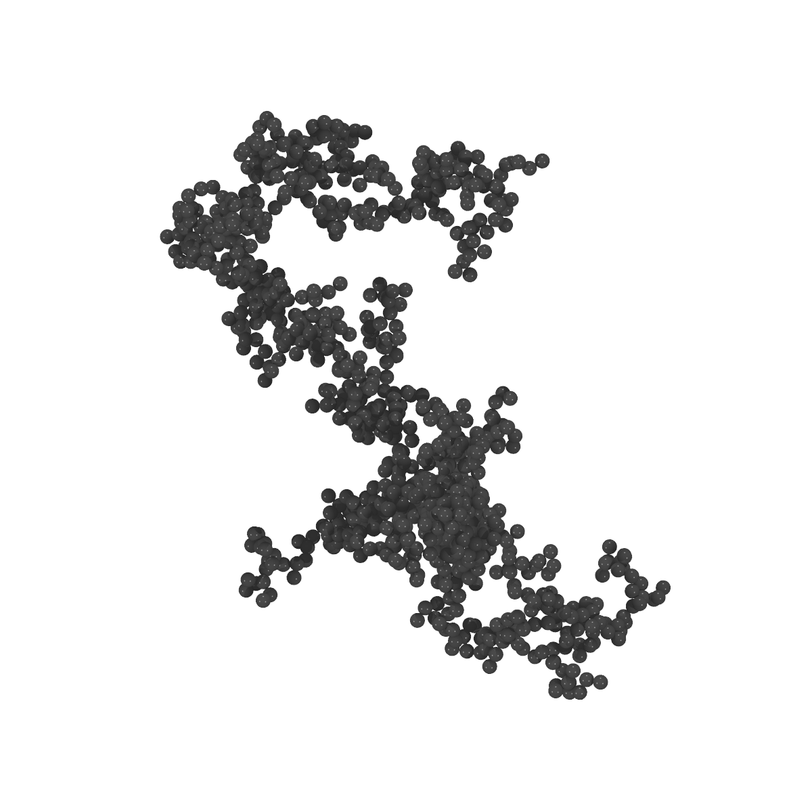</td>
      <td>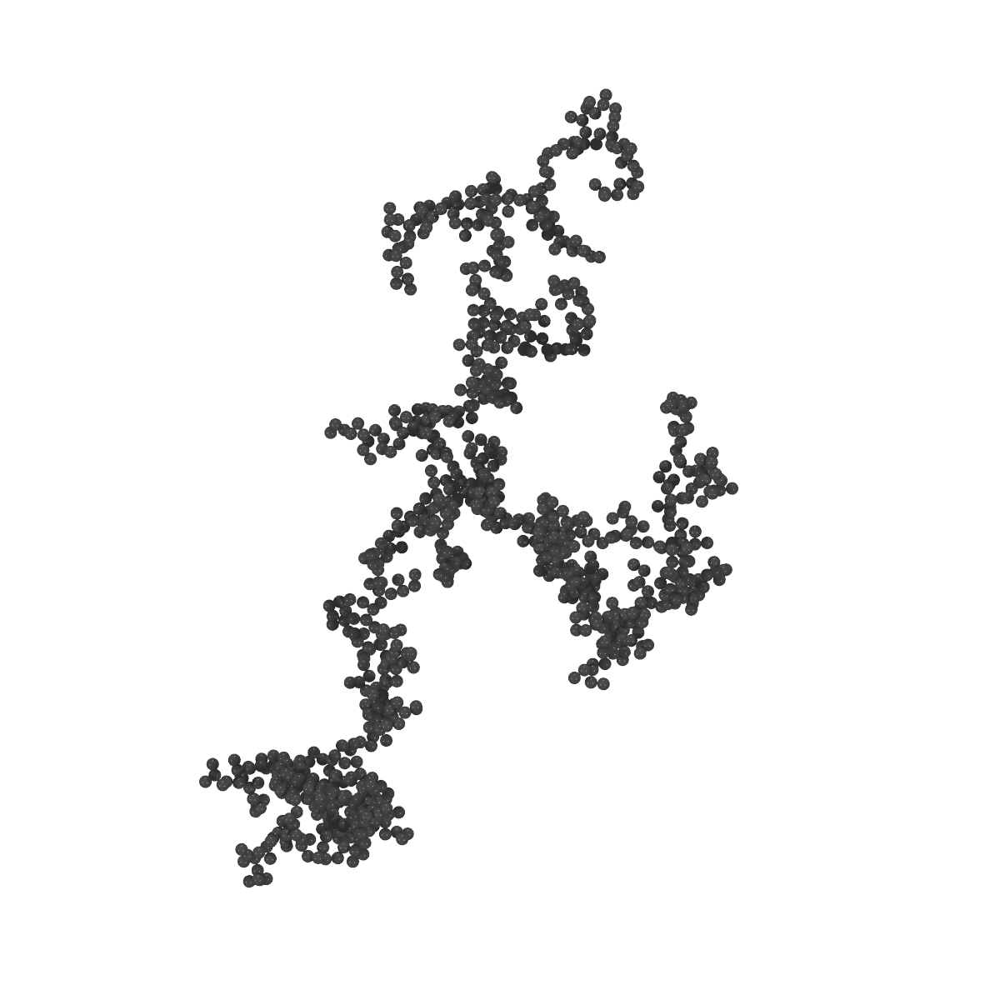</td>
    </tr>
    <tr>
      <td align="center"><em>Fig 4c: CC ballistic aggregate.</em></td>
      <td align="center"><em>Fig 4d: CC tunable aggregate.</em></td>
    </tr>
  </table>
</div>

**CC lifecycle control (validators, acceptors, viewers, and monitors)**

You can tightly control the Cluster-Cluster (CC) aggregation logic by attaching multiple evaluation hooks to your models:

Completion validators evaluate the final state of the aggregate. This works exactly the same way as it does in PC models.
```java
// If the fully generated geometry fails this condition, the entire aggregation process restarts.
model.addCompletionValidator((cluster, iteration) ->
        // Enforce a strict fractal dimension using the Mass-Radius algorithm.
        cluster.getFractalDimension(FractalDimension.MR_RESTRICTED) > 2.5);
```

Step acceptors evaluate the merging of two intermediate clusters. If the acceptor rejects the match, the attachment step repeats.
```java
// Define a temporary helper aggregate to evaluate the combined geometry.
FAggregate container = factory.getFAggregate();
// If the candidate merge fails this condition, the attachment step repeats.
model.addStepAcceptor((clusterA, clusterB) -> {
    // Only apply the criterion if the resulting geometry will have at least 100 particles.
        if (clusterA.size() + clusterB.size() < 100) {
            return true;
        }
        // Clear the helper aggregate from the previous iteration.
        container.clear();
        // Combine the particles from both clusters into the helper.
        container.addRefParticles(clusterA, clusterB);
        // Accept the merge only if the fractal dimension (measured via density-correlation) exceeds 2.0.
        return container.getFractalDimension(FractalDimension.DC_RESTRICTED) > 2.0;
});
```

Fragment viewers inspect the initial, small aggregates (fragments) generated by the preliminary PC procedure. These fragments serve as the starting seeds for the CC aggregation process.
```java
// Create a data container for plotting.
FPlotBar diameter = factory.getFPlotBar();

// Inspect all starting fragments right before the CC aggregation begins.
model.addFragmentViewer(fragment ->
        // Record the diameter of each fragment relative to its particle count.
        diameter.add(fragment.size(), fragment.getDiameter()));
```

Step monitors track dynamic data during the build process without altering the geometry. In CC models, this tracks the state of the two clusters being merged at each step.
```java
// Create a data container for plotting.
FPlotBar diameter = factory.getFPlotBar();
// Observe and record data across all stages of the aggregation process.
model.addStepMonitor((clusterA, clusterB, index) -> {
        // Record the diameter of the primary cluster.
        diameter.add(clusterA.size(), clusterA.getDiameter());
        // Note on lifecycle stages:
        // - During intermediate steps, both clusters exist and are about to merge.
        // - At the final step, the fully generated geometry is held in clusterA, and clusterB is null.
        if (clusterB != null) {
            // Record the diameter of the secondary cluster.
            diameter.add(clusterB.size(), clusterB.getDiameter());
        }
});
```

## Loading, saving, and exporting

The library provides dedicated aspects for serializing aggregates and exporting them to various external formats. This allows you to save your generated structures, import existing ones, or export them for external visualization.

**Loading**

You can reconstruct an `FAggregate` from a string representation. The default and most comprehensive format is JSON, which strictly preserves all component properties.

```java
String data = "...";                                                // The serialized string data.

var load = factory.load().aggregates();                             // Retrieve the loading context for aggregates.

FAggregate fAggregate = load.fromJSON(data);                        // Load from the default JSON format.     
FAggregate fAggregate = load.fromBasic(data, ExBasic.MULTISPHERE);  // Load from an alternative format.
```

**Saving**

For data storage, serialization, or transferring structures between processes, you can save aggregates into standard string formats. The JSON format is highly recommended as it strictly preserves all component properties.

```java
var save = factory.save().components();                             // Retrieve the saving context for components (including aggregates).

String data = save.toJSON(aggregate);                               // Save to the default JSON format.      
String data = save.toBasic(aggregate, ExBasic.MULTISPHERE);         // Save to an alternative format.
```

**Exporting**

When preparing an aggregate for external applications (such as meshing, rendering, or interfacing with legacy software),  you can use specialized exporters tailored to those target environments.

```java
var save = factory.save().components();                             // Retrieve the saving context for components (including aggregates).

String data = save.toFLAGE(aggregate);                              // Export to a format compatible with the FLAGE software.
String data = save.toNGSolve(aggregate);                            // Export for volumetric mesh generation using NetGen/NGSolve. 
String data = save.toPovRay(aggregate, ExPovRay.BOUNDARY);          // Export for high-quality 3D rendering using PovRay.
```

## Morphological analysis

Once an aggregate is generated or loaded into memory, you can perform various morphological analyses directly through its API.

### Core properties

This section provides fundamental information about the aggregate's size, composition, and constituent primary particles.

```java
// Returns the total number of primary particles that make up the geometry.
int size = fAggregate.size();

// Returns a comprehensive statistical summary of the primary particle radii.
FStat radius = fAggregate.getFStatParticleRadius();
```

Primary particles can also be accessed or iterated over directly for custom analysis:

```java
// Retrieves the underlying particle assembly reference.
FAssembly<Shape> fAssembly = fAggregate.getRefParticles();

// Iterates through individual primary particles.
for (var fParticle : fAggregate) {
    // Perform individual particle evaluation.
}

// Iterates through pairs of particles that are in direct contact.
fAggregate.forEachPairInContact((fParticle1, fParticle2) -> {
    // Perform pair particle evaluation.
});
```

### Connectivity and overlap

The library provides methods to evaluate internal structural integrity, overlap metrics, and spatial interactions between aggregates.

```java
// Evaluates internal structural integrity.
boolean isConnected = fAggregate.isConnected();
boolean isPointConnected = fAggregate.isPointConnected();
boolean isNonOverlapping = fAggregate.isNonOverlapping();

// Evaluates spatial relationships with another aggregate.
boolean touches = fAggregate.touches(otherAggregate);
boolean overlaps = fAggregate.overlaps(otherAggregate);

// Calculates statistical overlap measures across the structure.
FStat overlap = fAggregate.getOverlapFactor(OverlapFactor.PARTICLE_QUANTITATIVE);
```

The `getOverlapFactor` method returns an `FStat` object, which provides statistical analysis over a collection of calculated values. The `OverlapFactor` enum dictates exactly how these values are generated:

**Particle-Level Metrics**

For these methods, the `FStat` collection contains exactly one element per primary particle in the aggregate:

- **`PARTICLE_QUANTITATIVE`**: Returns the absolute count of overlaps (coordination number) for each particle.
- **`PARTICLE_LINEAR`**: Calculates the mean linear overlap for each particle. For any intersecting pair, the overlap is defined as `1 - d/(r1 + r2)`, where `d` is the distance between their centers.
- **`PARTICLE_VOLUMETRIC`**: Evaluates the overlapping volume fraction for each particle. The formula is `1 - (Vn / Vt)`, where `Vt` is the particle's total volume and `Vn` is its strictly non-overlapping volume. This metric is governed by the `delta` parameter.

**Cluster-Level Metrics**

For these methods, the `FStat` collection contains elements corresponding to structural overlap layers, rather than individual particles:

- **`CLUSTER_VOLUMETRIC`**: Evaluates the volume distribution across different intersection depths for the aggregate's overlapping regions. It returns the fraction of the total overlapped volume (`Vo`) shared by multiple particles. The distribution array starts at a depth of 2 particles: index `0` represents the volume fraction shared by exactly 2 particles (`V2 / Vo`), index `1` by 3 particles (`V3 / Vo`), and so on. The unshared volume is excluded from this calculation. This metric is governed by the `delta` parameter.

### Linear measurements

```java
// Returns the 3D bounding box as a pair of absolute minimum and maximum coordinates.
FPairPos3D boundary = fAggregate.getBoundary();

// Returns the maximum spatial span of the entire aggregate.
double diameter = fAggregate.getDiameter();

// Calculates the total length of the bounding box along the X, Y, and Z axes.
FPos3D length = fAggregate.getLength();
// Calculates a specific bounding box dimension based on the Length enum.
double length = fAggregate.getLength(Length.MAX);
```

The `Length` enum provides the following options for extracting specific dimensions:
- `X`, `Y`, `Z`: The bounding box length along the specific coordinate axis.
- `MIN`, `MAX`: The absolute minimum or maximum bounding box length among all three axes.

You can also calculate the maximum spanning radius originating from a specific point. 
This is useful when comparing different structural definitions of the aggregate. 
The method is overloaded to accept various input formats:

```java
// Calculates the spanning radius originating from explicitly defined raw coordinates.
double radius = fAggregate.getRadiusFrom(0.0, 0.0, 0.0);

// Calculates the spanning radius originating from a dynamically calculated center type.
double radius = fAggregate.getRadiusFrom(Center.MASS);

// Calculates the spanning radius originating from an existing FPoint or FPos3D object.
double radius = fAggregate.getRadiusFrom(fPoint);
double radius = fAggregate.getRadiusFrom(fPos3D);
```

When using dynamically calculated centers, the following `Center` enum definitions are available:
- `BOX`: The geometric center (centroid of the bounding box).
- `MASS`: The center of mass based on the particle mass distribution.
- `ORIGIN`: The absolute coordinate system origin (0, 0, 0).
- `SPHERE`: The center of the minimum bounding sphere enclosing the aggregate (100 iterations).

If you need the full spatial distribution rather than just the maximum boundary, you can extract the distances of all primary particles relative to a specific origin:

```java
// Returns a comprehensive statistical summary (FStat) of particle distances from the specified center.
FStat distances = fAggregate.getFStatParticleDistance(Center.MASS);
```

### Centers of mass and geometry

The aggregate's center point can be calculated using several different structural definitions.

```java
// Returns the geometric center (centroid of the bounding box).
FPos3D center = fAggregate.getBoxCenter();
// Returns the center of the minimum bounding sphere using a custom number of iterations (e.g., 500).
FPos3D center = fAggregate.getSphereCenter(500);
// Returns the center of mass based on a specific mass distribution type.
FPos3D center = fAggregate.getMassCenter(MassCenter.ADAPTIVE);
```

Because primary particles can vary in size, material, and overlap, the `MassCenter` enum dictates exactly how the mass distribution is integrated:

- **`SIMPLE_MONO`**: Approximates particles as mass points, ignoring overlap. While different materials are permitted, layered particles are not. It calculates a single, averaged radius and applies it uniformly to all particle positions.
- **`SIMPLE_POLY`**: Approximates particles as mass points, ignoring overlap. It accounts for different materials and layered particles, and evaluates each particle using its exact, individual size.
- **`VOLUMETRIC`**: Supports all shape types and overlapping geometries by decomposing the aggregate into a mesh. This requires passing an `FBuffer` object to handle the meshing operations, and the precision is governed by the `delta` parameter.
- **`ADAPTIVE`**: This approach makes a separate decision for each individual particle. It uses the fast `SIMPLE_POLY` logic where particles do not overlap, and strictly applies the `VOLUMETRIC` meshing logic to intersecting regions.

You can also retrieve any of the basic center coordinates dynamically using the general `getCenter` method and the `Center` enum:
```java
// Dynamically fetches the requested center type.
FPos3D center = fAggregate.getCenter(Center.BOX);
```

These center calculations are often invoked thousands of times inside tight iteration loops (e.g., during fractal dimension analysis or collision detection). To prevent massive Garbage Collection (GC) overhead from constantly instantiating new `FPos3D` objects, every method provides an overload that accepts a pre-allocated `FPoint`.

The `in` parameter acts as a data buffer: the method updates its internal coordinates and returns the exact same object, allowing for zero-allocation method chaining.

```java
// Pre-allocate the point once outside your loop.
FPoint bufferPoint = factory.getFPoint();

for (int i = 0; i < 1_000_000; i++) {
// The aggregate updates 'bufferPoint' and returns it, allowing direct chaining.
// No new objects are created in memory.
    double distance = fAggregate.getBoxCenter(bufferPoint).getDistance(target);
}
```

### Surface and volume

The library provides methods to calculate the total surface area and volume of the aggregate, as well as their equivalent sphere radii.

```java
// Calculates the total surface area and volume.
double surface = fAggregate.getSurface(Surface.ADAPTIVE);
double volume = fAggregate.getVolume(Volume.ADAPTIVE);

// Calculates the equivalent radius of a sphere with the exact same surface area or volume.
double rSurface = fAggregate.getSurfaceRadius(Surface.ADAPTIVE);
double rVolume = fAggregate.getVolumeRadius(Volume.ADAPTIVE);
```

Similar to center calculations, you can dictate exactly how these metrics are evaluated to balance performance with precision. The `Surface` and `Volume` enums provide three approaches:

- **`SIMPLE`**: An extremely fast approximation that completely ignores overlap. It simply sums the individual surface areas or volumes of all primary particles.
- **`DISCRETE`**: Evaluates overlapping geometries through discretization based on `delta`. For **volume**, it decomposes the structure into a 3D mesh. For **surface**, it breaks the outer bounds into small surface elements, removes those hidden inside overlapping particles, and sums the remainder. This requires a pre-injected `FBuffer`.
- **`ADAPTIVE`**: The optimal approach. It uses the fast `SIMPLE` mathematical logic for non-overlapping particles and dynamically applies the `DISCRETE` meshing logic strictly to intersecting regions.

If you need to perform custom spatial analysis, export the geometry to an external tool, or visualize the aggregate's exact continuous bounds, you can extract the underlying mesh generated by the engine directly:

```java
// Generates and returns the full mesh representation.
FMesh<FBufferData> mesh = fAggregate.getVolumeMesh();
```

### Gyration metrics

The library provides methods to analyze the spatial distribution of mass within the aggregate by calculating its gyration tensor and the radius of gyration.
```java
// Calculates the 3x3 gyration tensor matrix.
FMatrix3x3D tensor = fAggregate.getGyrationTensor(GyrationTensor.ADAPTIVE);
// Calculates the radius of gyration.
double rg = fAggregate.getRadiusOfGyration(RadiusOfGyration.SIMPLE_POLY_06R1);
```

Under the hood, these calculations automatically determine and use the corresponding mass center (as discussed in the **Centers** section) to ensure consistency.

For the **Gyration Tensor**, the `GyrationTensor` enum provides the standard approaches:
- **`SIMPLE_POLY`** and **`SIMPLE_MONO`**: Fast approximations that treat primary particles as mass points, either using their exact individual sizes or a single averaged size.
- **`VOLUMETRIC`**: Calculates an accurate spatial distribution by decomposing the geometry.
- **`ADAPTIVE`**: The optimal approach. It uses the fast `SIMPLE_POLY` logic where particles do not overlap, and applies meshing logic strictly to intersecting regions.

When calculating the **Radius of Gyration** using the simple mass-point approximations (`SIMPLE_MONO` and `SIMPLE_POLY`), the primary particles' own internal volumes are ignored.

To account for this, the `RadiusOfGyration` enum offers specific correction factors based on `r` (the averaged radius of all primary particles):
- **Base Methods (`SIMPLE_MONO`, `SIMPLE_POLY`)**: Strictly uses the point-mass approximation without any corrections.
- **`_06R1` Corrections**: Adds an offset of `0.6 * r` to the final calculation.
- **`_10R2` Corrections**: Adds an offset of `r * r` (or `r^2`) to the final calculation.
- **`VOLUMETRIC`**: Because this method accurately decomposes the full intersecting geometry, it inherently accounts for the particles' actual spatial distribution and requires no geometric corrections.

### Topological metrics

To deeply analyze the internal structure of the aggregate, the library provides methods to evaluate how primary particles are spatially arranged relative to one another.

Each of these metrics can be extracted in two formats: as an `FStat` object for basic statistical summaries (mean, variance, min, max), or as an `FPlot` object containing the distribution function data, which is ready to be visualized as a histogram.

```java
// Retrieve a statistical summary of the coordination numbers.
FStat coordStats = fAggregate.getCoordinationNumber();

// Retrieve the full distribution function for plotting.
FPlot coordPlot = fAggregate.getCoordinationNumberFunction();
```

The available topological metrics include:

- **Coordination Number** (`getCoordinationNumber` / `Function`): Evaluates how many direct neighbors (intersecting or touching) each primary particle has within the aggregate. When exported as an `FPlot`, it generates a discrete histogram ranging from 1 to the maximum coordination number, with a bin size of exactly 1.
- **Pair Distance** (`getPairDistance` / `Function`): Measures the spatial distances between the centers of primary particle pairs. The corresponding `FPlot` histogram spans from 0 to the maximum pair distance, dynamically scaling the number of bins based on the smallest primary particle radius (`max_distance / min_radius`).
- **Triplet Angle** (`getTripletAngle` / `Function`): Calculates the angles formed by triplets of adjacent primary particles, providing insight into the linearity, branching, and folding of the aggregate's chains. The `FPlot` histogram spans from 0 to π radians with exactly 180 bins, effectively providing a 1-degree resolution.

### Fractal dimension

This project implements two categories of fractal dimension extraction methods: structural and kinetic. 

#### Structural methods

Structural methods can be applied to any generated aggregate model or sphere assembly. Because they analyze the final geometry, they require no historical data about the aggregation process itself.

Currently, three structural algorithms are available: BC (Box-Counting), MR (Mass-Radius), and DC (Density Correlation). The simplest way to execute these measurements is by calling the desired method directly on the aggregate object:
```java
// 1. Box-Counting (BC)
// The original, unoptimized box-counting method. It iterates over vast amounts of empty space. 
// Unless you have plenty of time (or are paid by the hour), it should be used strictly for testing.
double dimBC = fAggregate.getFractalDimension(FractalDimension.BC_NAIVE);

// The baseline box-counting method. 
// It yields the exact same results as the naive method but is heavily optimized for speed.
double dimBC = fAggregate.getFractalDimension(FractalDimension.BC_BASELINE);

// The fully optimized box-counting method (recommended). 
// Includes advanced spatial procedures like grid-shifting and PCA alignment.
double dimBC = fAggregate.getFractalDimension(FractalDimension.BC_OPTIMIZED);

// 2. Mass-Radius (MR)
// The mass-radius method utilizing boundary restriction.
double dimMR = fAggregate.getFractalDimension(FractalDimension.MR_RESTRICTED);

// 3. Density Correlation (DC)
// The density correlation method utilizing boundary restriction.
double dimDC = fAggregate.getFractalDimension(FractalDimension.DC_RESTRICTED);
```

If you need insights into the algorithm's performance or visual representations of the results, you can capture this auxiliary data using a metadata container:
```java
// Create a container to capture the diagnostic metadata.
FMetaDF fMeta = factory.getFMetaDF();

// Pass the metadata object as the second parameter during the extraction.
double dimBC = fAggregate.getFractalDimension(FractalDimension.BC_OPTIMIZED, fMeta);

// Retrieve the metrics
long   time = fMeta.getExecutionTimeMillis(); // Algorithm execution time in milliseconds.
String plot = fMeta.getPythonRenderScript();  // Python Plotly script to render the resulting chart.
FPlot  data = fMeta.getRefData();             // Raw coordinate data used to calculate the dimension.
```

If you need a more granular approach, you can configure each method manually using a custom configuration object:
```java
// 1. Box-Counting (BC) Custom Configuration
FConfigBC fConfigBC = factory.getFConfigBC()
                .setAlignedOrigin(false)        // Toggles whether the geometry is moved to the center of the Cartesian axis (0,0,0).
                .setAlignedPCA(true)            // Enables the Principal Component Analysis (PCA) alignment procedure.
                .setShiftsPerAxis(3)            // Sets the number of spatial grid shifts per axis.
                .setScalingFactor(2.0)          // Defines the box size scaling factor for each iteration.
                .setWindowRatio(0.9);           // Sets the ratio of the sliding window used for the linear fit.

// Create a BC-specific metadata container (currently shares the same elements as the default FMetaDF interface).
FMetaBC fMetaBC = factory.getFMetaBC();

// Extract the fractal dimension using the custom configuration. The metadata object is optional.
double dimBC = fAggregate.getFractalDimension(fConfigBC, fMetaBC);

// -------------------------------------------------------------------------------------------------

// Alternatively, you can initialize the configuration object using one of the built-in presets.
// This is especially useful for scientific reproducibility.
FConfigBC fConfigPreset = factory.getFConfigBC(FConfigBC.Preset.MAN_072026_SHIFT_PCA);
```

```java
// 2. Mass-Radius (MR) Custom Configuration
FConfigMR fConfigMR = factory.getFConfigMR()
                .setRadiusOfGyration(RadiusOfGyration.SIMPLE_POLY)  // Sets the method used to calculate the radius of gyration.
                .setScalingFactor(1.1)                              // Defines the radial scaling factor for each iteration.
                .setRestricted(true)                                // Applies the boundary restriction procedure.
                .setWindowRatio(0.9);                               // Sets the ratio of the sliding window used for the linear fit.

// Create an MR-specific metadata container (extends standard FMetaDF metrics with MR-specific ones).
FMetaMR fMetaMR = factory.getFMetaMR();

// Extract the fractal dimension using the custom configuration. The metadata object is optional.
double dimMR = fAggregate.getFractalDimension(fConfigMR, fMetaMR);

// Retrieve MR-specific diagnostic data.
int refs = fMetaMR.getRefParticlesCount();                          // Retrieves the number of reference particles used.

// -------------------------------------------------------------------------------------------------

// Alternatively, you can initialize the configuration object using one of the built-in presets.
FConfigMR fConfigPreset = factory.getFConfigMR(FConfigMR.Preset.FULL);
```

```java
// 3. Density Correlation (DC) Custom Configuration
FConfigDC fConfigDC = factory.getFConfigDC()
                .setRadiusOfGyration(RadiusOfGyration.SIMPLE_POLY)  // Sets the method used to calculate the radius of gyration.
                .setScalingFactor(1.1)                              // Defines the radial scaling factor for each iteration.
                .setRestricted(true)                                // Applies the boundary restriction procedure.
                .setWindowRatio(0.9);                               // Sets the ratio of the sliding window used for the linear fit.

// Create a DC-specific metadata container (extends standard FMetaDF metrics with DC-specific ones).
FMetaDC fMetaDC = factory.getFMetaDC();

// Extract the fractal dimension using the custom configuration. The metadata object is optional.
double dimDC = fAggregate.getFractalDimension(fConfigDC, fMetaDC);

// Retrieve DC-specific diagnostic data.
int refs = fMetaDC.getRefParticlesCount();                          // Retrieves the number of reference particles used.

// -------------------------------------------------------------------------------------------------

// Alternatively, you can initialize the configuration object using one of the built-in presets.
FConfigDC fConfigPreset = factory.getFConfigDC(FConfigDC.Preset.FULL);
```

#### Kinetic methods

Kinetic methods, on the other hand, require a monitor to be injected during the aggregation process. A monitor is simply an object that collects data at each step of the simulation. While you can easily create custom monitors, the most common ones are already built-in. For instance, you will use the radius of gyration monitor to measure the PL (Power-Law) fractal dimension. Note that there are separate monitors for the PC (Particle-Cluster) and the CC (Cluster-Cluster) aggregation processes.

##### Particle-Cluster (PC) aggregation

```java
// Create an unassembled fractal aggregate model.
var fAggregate = factory.aggregates().templates().monodisperse(1000, 1.0);

// Create a predefined monitor to capture the radius of gyration of the growing aggregate at each step.
// The first parameter sets the calculation method.
// The second (optional) parameter defines how many initial steps to skip.
var fMonitor = factory.monitors().pc().radiusOfGyration(RadiusOfGyration.SIMPLE_MONO_10R2, 5);

// This skip excludes early generation stages where the geometry is too small to be considered a true fractal.
// At very low particle counts, different calculation methods can yield inconsistent radii. 
// Additionally, early correction procedures for compact aggregates can temporarily distort the radius of the position sphere.

// Define the aggregation model and target fractal parameters.
var fModel = factory.models().pc().tunable(fAggregate, 1.8, 1.3);

// Add a monitor.
fModel.addStepMonitor(fMonitor);

// Assemble the aggregate.
fModel.build();

// Raw measurement data.
FPlot data = fMonitor.getRefFPlot();

// Create the configuration object.
FConfigPCPL fConfigPCPL = factory.getFConfigPCPL()
        .setDropRatio(0.0)                      // Sets the percentage of initial steps that should be excluded from the linear fit. 
        .setWindowRatio(0.9);                   // Sets the ratio of the sliding window used for the linear fit.

// Create a PC/PL-specific metadata container. Since kinetic methods are very different from structural ones, there is no shared parent.
FMetaPCPL fMeta = factory.getFMetaPCPL();

// Extract the fractal dimension using the custom configuration. The metadata object is optional.
double dimPL = fMonitor.getPowerLawDimension(fConfigPCPL, fMeta);

// Retrieve PC/PL-specific diagnostic data.
String plot = fMeta.getPythonRenderScript();    // Python Plotly script to render the resulting chart.

// -------------------------------------------------------------------------------------------------

// Alternatively, you can initialize the configuration object using one of the built-in presets.
FConfigPCPL fConfigPreset = factory.getFConfigPCPL(FConfigPCPL.Preset.WINDOW);
```

##### Cluster-Cluster (CC) aggregation

```java
// Create an unassembled fractal aggregate model.
var fAggregate = factory.aggregates().templates().monodisperse(1000, 1.0);

// Create a predefined monitor for capturing the radius of gyration of the growing geometry at each iteration step.
// The parameter sets the method used to calculate the radius of gyration.
var fMonitor = factory.monitors().cc().radiusOfGyration(RadiusOfGyration.SIMPLE_MONO_10R2);

// The CC process merges already-generated PC clusters, eliminating the need for a skip parameter.

// Define the aggregation model and target fractal parameters.
FModelCCTunable fModel = factory.models().cc().tunable(fAggregate, 1.8, 1.3);

// Add a monitor.
fModel.addStepMonitor(fMonitor);

// Assemble the aggregate.
fModel.build();

// Raw measurement data.
FPlotBar data = fMonitor.getRefFPlotBar();

// Create the configuration object.
FConfigCCPL fConfigCCPL = factory.getFConfigCCPL()
        .setDropRatio(0.0)                      // Sets the percentage of initial steps that should be excluded from the linear fit. 
        .setWindowRatio(0.9)                    // Sets the ratio of the sliding window used for the linear fit.
        .setReducer(FStat::mean);               // Set the reducer. Since multiple clusters can contain the same number of particles, their measurements must be reduced to a single value.

// Create a CC/PL-specific metadata container.
FMetaCCPL fMeta = factory.getFMetaCCPL();

// Extract the fractal dimension using the custom configuration. The metadata object is optional.
double dimPL = fMonitor.getPowerLawDimension(fConfigCCPL, fMeta);

// Retrieve CC/PL-specific diagnostic data.
String plotParsed = fMeta.getPythonRenderScript(FMetaCCPL.Plot.PARSED);     // Python Plotly script to render the resulting chart after using the reducer.
String plotRaw = fMeta.getPythonRenderScript(FMetaCCPL.Plot.RAW);           // Python Plotly script to show measured raw data.

// -------------------------------------------------------------------------------------------------

// Alternatively, you can initialize the configuration object using one of the built-in presets.
// This is especially useful for scientific reproducibility.
FConfigCCPL fConfigPreset = factory.getFConfigCCPL(FConfigCCPL.Preset.WINDOW);
```

## How to cite

This software is entirely open-source. While citations are by no means required, they are appreciated and help support the ongoing development of this project.

If you use the software in your research, please consider citing the foundational manuscript:

**General usage (Aggregation core):**
> K. Skorupski, J. Mroczka, T. Wriedt, and N. Riefler, "A fast and accurate implementation of tunable algorithms used for generation of fractal-like aggregate models," *Physica A*, vol. 404, pp. 106-117, 2014. DOI: [10.1016/j.physa.2014.02.072](https://doi.org/10.1016/j.physa.2014.02.072)

> **Note:**
> The publication above covers the core aggregation elements. An updated citation covering the latest analysis modules will be added once our upcoming manuscript is published.

## License

Copyright (C) 2026 Krzysztof Skorupski

This program is free software: you can redistribute it and/or modify
it under the terms of the GNU Affero General Public License version 3.

*For the full license text, please see the [LICENSE](LICENSE) file in this repository.*