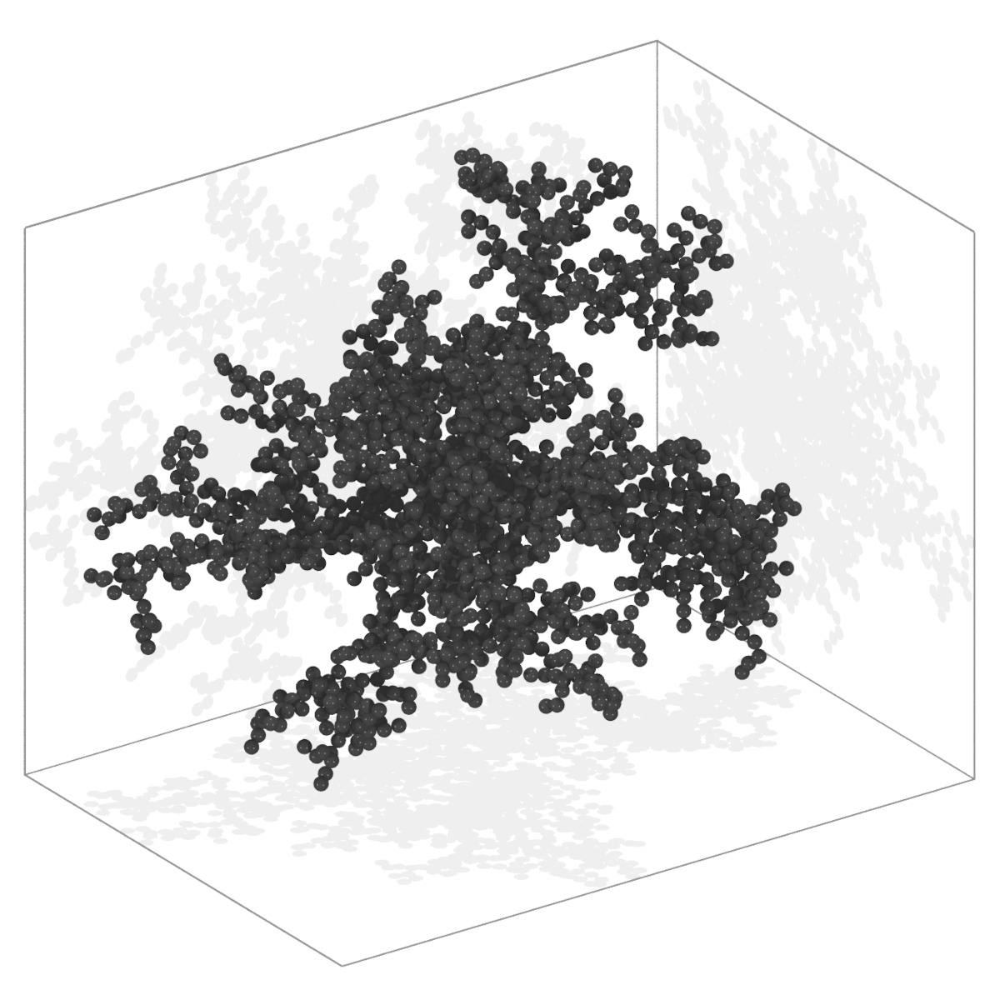

# Scattering Core CLI

[](https://pypi.org/project/scatter-cli/)
[](https://www.npmjs.com/package/@light-scattering/scatter-cli)

The Scattering Core CLI provides a standalone command-line interface for the [Scattering Core](https://github.com/light-scattering/scattering.core) library.

## Table of contents

- [Getting started](#getting-started)
  - [Java](#java)
  - [Wrappers](#wrappers)
- [Commands](#commands)
  - [Generate](#generate)
    - [Export](#export)
    - [Examples](#examples)
  - [Measure](#measure)
    - [Import](#import)
    - [Examples](#examples-1)
  - [Transform](#transform)
    - [Import and export](#import-and-export)
    - [Examples](#examples-2)


## Getting started

You can run the CLI either directly via the Java archive or by using one of the wrappers.

### Java

To run the CLI directly via the Java runtime, use the following syntax:
```bash
java -jar scatter-cli.jar <command> [OPTIONS]
```

To verify your setup, use the built-in demo command. It generates a standard Cluster-Cluster (CC) aggregate composed of 2,048 primary particles with fractal parameters `df=1.8` and `kf=1.3`, exported in the `multisphere` format.
```bash
java -jar scatter-cli.jar demo
```

### Wrappers

If you installed the CLI via a package manager, the Java runtime is handled automatically. You can drop the `java -jar` prefix and use the global command directly:
```bash
scatter-cli <command> [OPTIONS]
```

For example, running the quick start demo is as simple as:
```bash
scatter-cli demo
```

For installation instructions and wrapper-specific documentation, please visit their respective repositories:
* **[Node.js (NPM)](https://www.npmjs.com/package/@light-scattering/scatter-cli)**
* **[Python (PyPI)](https://pypi.org/project/scatter-cli/)**

## Commands

The CLI is built around three core commands: `generate`, `transform`, and `measure`.

### Generate

Generates particle assemblies.
```bash
scatter-cli generate [COMMAND]
```

The main command is divided into two categories:
- **`geometry`**: Generates standard geometric arrangements.
- **`model`**: Generates synthetic, fractal-like aggregate models.

Because the `generate` command uses a nested structure, you can explore the available options at any level by invoking the chain without additional arguments.

To view the list of supported options for any specific generator, use the help flag:
```bash
scatter-cli generate model cc dlca --help
```

#### Export

You can customize the assembly format and save the output directly to a file using the export flags.

I/O flags:
- **`-e, --export`**: Sets the output assembly format (default: `json`).
- **`-o, --out`**: Defines the destination file path. If omitted, the transformed data is printed directly to `stdout`.

#### Examples

Generate a 2D grid and print the JSON directly to `stdout`:
```bash
scatter-cli generate geometry grid2D 1 12 14
```

Generate a Particle-Cluster (PC) Diffusion-Limited Aggregation (DLA) model, format it for POV-Ray, and save to a file:
```bash
scatter-cli generate model pc dla --rad-fixed 2048,1 --export povray --out assembly.pov
scatter-cli generate model pc dla --rf 2048,1 -e povray -o assembly.pov
```

<div align="center">
  <table>
    <tr>
      <td></td>
    </tr>
    <tr>
      <td align="center"><em>Fig 1: PC DLA synthetic fractal-like aggregate model.</em></td>
    </tr>
  </table>
</div>

### Measure

Calculates morphological parameters of particle assemblies.
```bash
scatter-cli measure [OPTIONS] [file]
```

To view the complete list of all supported metric tags and configuration options, use the built-in help flag:
```bash
scatter-cli measure --help
```

Key command options:
- **`-m, --metrics`**: Defines the parameters to calculate. Separate multiple metric tags with a space.
- **`-e, --epsilon`**: Continuous geometric tolerance (default: `1E-4`).
- **`-d, --delta`**: Discrete grid resolution (default: `1E-2`).
- **`-b, --buffer`**: Reusable data buffer size.

#### Import

The input file is a positional argument and can be placed anywhere in the command. If omitted, or if `-` is provided, the CLI reads directly from standard input (`stdin`).

I/O flags:
- **`-i, --import`**: Sets the input assembly format (default: `json`).

#### Examples

Measure static fractal dimensions from a multisphere format:
```bash
scatter-cli measure --metrics df-bc df-mr df-dc --import multisphere assembly.xyzr
scatter-cli measure -m df-bc df-mr df-dc -i multisphere assembly.xyzr
```

Calculate the mass center using mesh decomposition with a custom resolution and buffer:
```bash
scatter-cli measure --delta 0.5 --buffer 1000 --metrics cm-mesh --import multisphere assembly.xyzr
scatter-cli measure -d 0.5 -b 1000 -m cm-mesh -i multisphere assembly.xyzr
```

### Transform

Applies sequential transformations to an existing particle assembly.
```bash
scatter-cli transform [OPTIONS] [file]
```

To view the complete list of transformation options, use the built-in help flag:
```bash
scatter-cli transform --help
```

Transformations (like `--rotate` and `--translate`) can be declared multiple times in a single command. They are executed in the exact sequential order they appear.

#### Import and export

The input file is a positional argument and can be placed anywhere in the command. If omitted, or if `-` is provided, the CLI reads directly from standard input (`stdin`).

I/O flags:
- **`-i, --import`**: Sets the input assembly format (default: `json`).
- **`-e, --export`**: Sets the output assembly format (default: `json`).
- **`-o, --out`**: Defines the destination file path. If omitted, the transformed data is printed directly to `stdout`.

#### Examples

Perform multiple, chained transformation tasks in a specific sequence:
```bash
scatter-cli transform --rotate 1,0,0,1.5708 --translate 1,2,3 --rotate 0,1,0,1.5709 --pca assembly.json
```

Convert the assembly format from JSON to POV-Ray:
```bash
scatter-cli transform assembly.json --import json --export povray --out assembly.pov
scatter-cli transform assembly.json -i json -e povray -o assembly.pov
```


